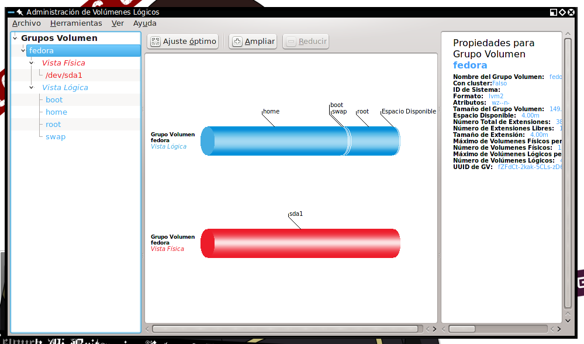

--Note: basado en el trabajo de @Deicidium, ofuscado y adaptado a Markdown.

LVM es un método de particionar las unidades de disco duro que proporciona una mayor flexibilidad en la gestión de espacio de almacenamiento que el método tradicional de particionado de disco. Logical Volume Manager o LVM, ha sido una característica del kernel de Linux desde 1999 aproximadamente, y fue contribuido (al kernel de Linux) por Sistina Software, Inc, empresa que luego fue adquirida por Red Hat.

Otros Sistemas Operativos similares a UNIX como AIX, HP-UX y Sun Solaris - tienen su propia aplicación de gestión de volúmenes lógicos. Mas hasta hace poco, no existía una tecnología equivalente - En cuanto a prestaciones - en las distribuciones BSD. FreeBSD sólo recientemente ha añadido soporte experimental para el sistema de archivos ZFS una tecnología desarrollada por Oracle que implementa algunas de las características de LVM. http://www.linuxbsdos.com/2008/09/24/the-benefits-of-using-linux-logical-volume-manager/

#Conceptos básicos de LVM
------------------------------

Con LVM, el disco duro o grupo de discos duros está localizado para uno o más volúmenes físicos (PV). Un volumen físico no abarca más de una unidad de disco duro.

Los volúmenes físicos son combinados en grupos de volúmenes lógicos, a excepción de la partición /boot. La partición /boot/ no puede estar en un grupo de volúmenes lógicos, porque el gestor de arranque no puede leerlo. Si la partición raíz ( / ) está en un volumen lógico, necesitará crear una partición ( /boot ) separada que no sea parte de un grupo de volumen.

Ya que un volumen físico no puede abarcar más de una unidad, si desea que el grupo de volumen abarque más de una unidad, se deberán crear uno o más volúmenes físicos por unidad.



#Anatomía de un LVM
------------------------------

Un LVM se descompone en tres partes:

* Volúmenes físicos (PV): Son las discos duros físicos en un sistema de archivos LVM.

* Volúmenes lógicos (LV): es el equivalente a una partición en un sistema tradicional. El LV es visible como un dispositivo estándar de bloques, por lo que puede contener un sistema de archivos, por ejemplo (/home).

* Grupos de volúmenes (VG): es la parte superior de la LVM. Es la "caja" en la que tenemos nuestros volúmenes lógicos (LV) y nuestros volúmenes físicos (PV). Se puede ver como una unidad administrativa en la que se engloban nuestros recursos. Hay que hacer notar que mientras un PV no se añada al VG, no podemos comenzar a usarlo.


#Pasos básicos para crear un sistema de particionamiento LVM


* Crear un sistema de ficheros independiente a la arreglo LVM con punto de montaje /boot, un sistema de archivo ext3 o ext4, con un tamaño de 256 a 512 MB.

* Comenzando con un disco duro, creamos un volúmen físico (PV)

*Crear un grupo de volúmenes (VG). Un grupo de volúmenes es contenedor virtual para uno o más volúmenes físicos (discos duros).

* Añadir los volúmenes físicos al grupo de volúmenes. El tamaño del grupo de volúmenes debe ser mayor o igual a la suma de los volúmenes físicos.

* Crear volúmenes lógicos. Un volúmen lógico (LV). Los LV son los equivalentes a las particiones, en un sistema de particionamiento estándar.

*Asignamos sistemas de ficheros a los volúmenes lógicos.


#Ventajas de usar LVM

* Una de las decisiones que afronta un usuario instalando GNU/Linux es cómo particionar el disco duro. La necesidad de estimar cuanto espacio será necesario para el sistema, para los temporales o para los datos personales, puede convertirse en algo problemático, por lo que muchos usuarios optan por crear una partición que ocupe todo el disco y allí introducir los datos. Aún habiendo estimado correctamente cuánto espacio se necesita para /home, /usr, /tmp, o cualquier otro directorio importante, es bastante común que nos quedemos sin espacio en estas particiones, cuando tenemos espacio de sobra en alguna otra. Con el uso de un administrador de volúmenes lógicos, el disco completo puede ser asignado a un único grupo lógico y definir distintos volúmenes lógicos para almacenar /home u otros directorios. En el caso que nos quedemos sin espacio, por ejemplo, en /home, y tenemos espacio en /opt, podríamos redimensionar /home y /opt y usar el espacio que le hemos quitado a /opt y añadírselo a /home. Hay que tener en cuenta, que para realizar esto, nuestro sistema de ficheros debe soportar el redimensionado por arriba y por abajo, como ReiserFS.

* Otra alternativa sería dejar una cierta cantidad de espacio del disco sin asignar y cuando fuera necesario, expandir el volumen.

* Administrar un sistema con muchos discos es un trabajo que consume tiempo, y se hace particularmente complejo si el sistema contiene discos de distintos tamaños. Equilibrar los requerimientos de almacenamiento de distintos usuarios (a menudo conflictivos) puede ser una tarea muy laboriosa y compleja.

* Los distintos grupos de usuarios  pueden tener sus volúmenes lógicos y éstos pueden crecer lo que sea necesario, y el administrador puede realizar las operaciones oportunas sobre dichos volúmenes.

#Gestión a través de una interfaz gráfica de usuario

Como superusuario instalar la herramienta de configuración de LVM:

```bash
 yum install -y system-config-lvm
 ```

en Debian:

```bash
 apt-get install system-config-lvm

 apt-get install kvpm
```

Abrimos la herramienta ingresando en una terminal como superusuario la orden:

```bash
 dbus-launch system-config-lvm &
```

#Lista de comandos de terminal de LVM:


#Aumentar el tamaño de un volumen lógico por terminal

Listamos las particiones del volumen lógico:

```bash
 lvm lvscan
```

Desmontamos la partición deseada. Nota: en este ejemplo será "/dev/Ejemplo/Home" y le aumentaremos 20 GB.

```bash
 umount /dev/Ejemplo/Home
```

Asignamos los 20 GB a la partición deseada:

```bash
 lvextend -L+20G /dev/Ejemplo/Home
```

Revisamos el sistema de ficheros:

```bash
 e2fsck -f /dev/Ejemplo/Home
```

Redimensionamos:

```bash
 resize2fs /dev/Ejemplo/Home
```

#Reducir el tamaño de un volumen lógico por terminal

Nota: esta operación es peligrosa, y debe hacerse un respaldo de los datos antes de hacerse.

Listamos las particiones del volumen lógico:

```bash
 lvm lvscan
```

Desmontamos el volumen lógico. Nota: en este ejemplo será "/dev/Ejemplo/Home" y le reduciremos 20 GB.

```bash
 umount /dev/Ejemplo/Home
```

Revisamos el sistema de ficheros:

```bash
 e2fsck -f /dev/Ejemplo/Home
```

Redimensionamos la partición física:

```bash
 resize2fs -p /dev/Ejemplo/Home 20G
```

Reducimos el volumen lógico con el mismo valor:

```bash
 lvreduce -L 20G /dev/Ejemplo/Home
```

Revisamos otra vez el sistema de ficheros:

```bash
 e2fsck -f /dev/Ejemplo/Home
```

Comprobamos que todo este en orden con:

```bash
 resize2fs -p /dev/Ejemplo/Home
```

Montamos el volumen lógico:

```bash
 mount /dev/Ejemplo/Home
```

#Referencias

== Enlaces externos ==

* http://unix.stackexchange.com/questions/32145/how-to-expand-lvm2-partition-in-fedora-linux

* http://www.techotopia.com/index.php/Adding_a_New_Disk_to_a_Fedora_Volume_Group_and_Logical_Volume

* http://www.esdebian.org/wiki/uso-lvm-debian

* https://access.redhat.com/site/documentation/en-US/Red_Hat_Enterprise_Linux/6/html/DM_Multipath/multipath_logical_volumes.html

* http://linuxmoz.com/lvcreate-example-create-logical-volume-linux/

* https://wiki.archlinux.org/index.php/LVM

* http://ostechnix.wordpress.com/2013/02/03/linux-basics-lvm-logical-volume-manager-tutorial/

* http://www.howtoforge.com/linux_lvm

* http://linux-bsd-sharing.blogspot.com/2012/06/howto-shrink-size-of-ext4-lvm-logical.html

* http://www.howtogeek.com/howto/40702/how-to-manage-and-use-lvm-logical-volume-management-in-ubuntu/

* https://www.suse.com/documentation/sles11/stor_admin/data/bbillhs.html

* http://linux.cloudibee.com/2010/01/dynamically-detecting-new-disks-in-linux/

* http://studyhat.blogspot.com/2013/01/add-new-lun-to-live-multipath.html

* http://rm-rf.es/dm-multipath-en-redhat-y-centos/

* https://access.redhat.com/documentation/en-US/Red_Hat_Enterprise_Linux/6/html/DM_Multipath/mpio_setup.html

* http://ask.xmodulo.com/expand-xfs-file-system.html

* http://fedoraproject.org/wiki/Features/SystemStorageManager

* http://xmodulo.com/manage-lvm-volumes-centos-rhel-7-system-storage-manager.html

* http://storagemanager.sourceforge.net/

* http://www.stankowic-development.net/?p=5033&lang=en

* https://access.redhat.com/documentation/en-US/Red_Hat_Enterprise_Linux/7/html/Storage_Administration_Guide/ch15s02.html

* https://access.redhat.com/documentation/en-US/Red_Hat_Enterprise_Linux/7/pdf/DM_Multipath/Red_Hat_Enterprise_Linux-7-DM_Multipath-en-US.pdf
